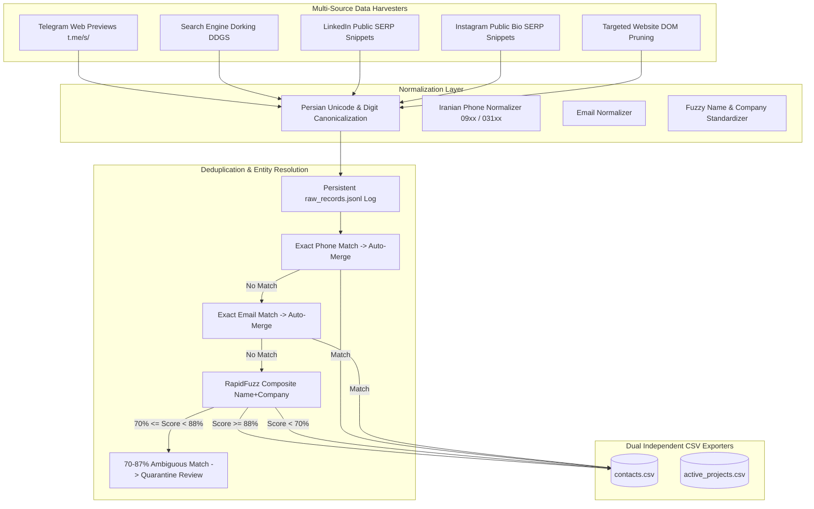

# 🏗️ Noavaran Panjereh Lead Discovery & Project Intelligence Engine

> **High-Precision Autonomous Lead Discovery, Entity Matching & Deduplication System for Noavaran Panjereh (نوآوران پنجره - اصفهان)**


---

## 📌 1. Project Overview & Business North Star

**Noavaran Panjereh** (formerly Arvin Panjereh Partak / Esfahan Novin) is a premier architectural door, window, and facade manufacturer based in Isfahan, specializing in:
- High-performance **thermal-break aluminium windows & doors** (Lift & Slide, monorail, accordion, balcony glass).
- **Curtain wall / lamella facades** (Cap, Face Cap, U-Channel, skylights, add-on systems).
- **Frameless glass facades**, dry ceramics/louvers, aluminium composite panels, and structural glass railings.

This engine autonomously harvests high-intent B2B leads across **4 core categories**:
1. **Architecture & Construction Offices**: Architectural design firms, engineering consultants, and lead designers.
2. **Construction Contractors**: Facade contractors, structural builders, licensed general contractors (`مجری ذیصلاح`), and window installers.
3. **Architecture Students**: Junior talent and student researchers (exhaustive in Isfahan, strictly gatekept outside Isfahan).
4. **Active Building & Construction Projects**: Projects with scale/scope, tied architects, and contractors.

---

## 🏛️ 2. Architectural Design & Multi-Source Harvesters



### Key Data Ingestion Principles:
1. **Telegram Web Previews (`https://t.me/s/<channel>`)**: Direct HTTP GET ingestion of public Telegram channels and groups. Requires zero authentication, no user phone number, and incurs **zero platform ban risk**.
2. **Search Engine Dorking for LinkedIn & Instagram**: In accordance with v1 scope and platform ban avoidance, LinkedIn and Instagram are **never scraped directly**. Instead, search engine indexes (`site:linkedin.com/in`, `site:linkedin.com/company`, `site:instagram.com`) are leveraged to extract rich bio snippets, usernames, telephone numbers, and addresses.
3. **Targeted Zero-Token Web Extraction**: Corporate websites discovered during search passes are pruned of scripts, styles, SVG icons, and navigation headers, extracting contact details with pure deterministic regular expressions.

---

## 🎯 3. Geographic Prioritization & Tier-Gating Engine

| Geographic Tier | Category Gating Policy | Filtering Rules |
| :--- | :--- | :--- |
| **Isfahan** | **Exhaustive Sweep** | Every architectural office, contractor, student, and active project is admitted with **zero filtering**. |
| **Other Iranian Cities** | **Strict Quality Gating** | • **Active Projects**: Admitted ONLY if large-scale/big-span (towers, hospitals, malls, civic complexes, $\ge 7$ floors or $\ge 3000\,\text{m}^2$).<br>• **Offices & Contractors**: All admitted.<br>• **Students**: Admitted ONLY if top-tier (see filter below). |
| **International** | **Opportunistic** | Admitted only if high-intent facade/architecture consulting firms (Dubai/UAE, Muscat, Doha, Europe). |

### Concrete "Best" Filter for Non-Isfahan Architecture Students
Students outside Isfahan are admitted if and only if they match at least one verified qualification marker:
1. **Top University Program**: University of Tehran (دانشگاه تهران), Shahid Beheshti (شهید بهشتی), Iran University of Science & Technology - IUST (علم و صنعت), Tarbiat Modares (تربیت مدرس), Sharif / Amirkabir.
2. **National / International Competition Laureates**: Memar Award (جایزه معمار), Mirmiran Award (جایزه میرمیران), 2A Architectural Awards, ArchDaily/Dezeen featured.
3. **Publication / Leadership**: Published research on Civilica/Magiran/ISC or Scientific Architecture Association leadership.

---

## 🔄 4. Duplicate-Merging System

- **Pre-Merge Raw Record Logging**: Every incoming entity payload is immutably logged into `raw_records` table and `raw_records.jsonl` before any matching decision.
- **Primary Exact-Match (Auto-Merge)**: Exact matches on normalized phone (`0913...`, `031...`) or email auto-merge immediately with `verified` confidence.
- **Secondary Fuzzy Composite Match**: Normalized composite string `clean_name + clean_company` is evaluated with `rapidfuzz.fuzz.token_sort_ratio` and `token_set_ratio`:
  - **Score $\ge 88.0\%$**: Auto-merged with `high_fuzzy` confidence.
  - **$70.0\% \le \text{Score} < 88.0\%$**: Quarantined into `ambiguous_reviews` table and logged in review audit for human inspection without auto-merging.
  - **Score $< 70.0\%$**: Created as distinct entity.
- **Lossless URL Retention**: All discovered URLs are merged into a semicolon-delimited chain (`https://site.ir; https://instagram.com/xyz`). **No source URL is ever discarded.**

---

## 📊 5. Output Schemas

The engine generates two strictly separate CSV files:

### `active_projects.csv`
| Column | Description |
| :--- | :--- |
| `project name` | Title/name of the project |
| `city` | Project location (e.g. Isfahan, Tehran) |
| `scale/scope` | Floors, area in sqm, facade specifications |
| `associated contractor(s)` | Semicolon-separated contractor firms |
| `associated architect(s)/office` | Semicolon-separated architect firms |
| `contact info` | Project manager phone, email, or handle |
| `source URL` | Semicolon-separated source attribution links |
| `confidence` | Confidence level (`verified`, `high`, `medium`) |
| `date found` | Date registered (YYYY-MM-DD) |

### `contacts.csv`
| Column | Description |
| :--- | :--- |
| `entity_type (office/contractor/student/individual)` | Target category classification |
| `name` | Lead person name or representative |
| `role` | Professional title (e.g. Lead Architect, Project Manager) |
| `company` | Office or company name |
| `city` | Geographic location |
| `phone` | Normalized telephone / mobile number |
| `email` | Normalized email address |
| `social handle` | Telegram / Instagram handle (@...) |
| `source_url` | Full source URL provenance chain |
| `confidence` | Confidence indicator (`verified`, `high`, `high_fuzzy`) |
| `last_verified` | Verification timestamp (YYYY-MM-DD) |

---

## 🚀 6. CLI Usage & Operations

### Run Autonomous Crawler
```bash
# Standard balanced run (default budget: 180s, max 12 passes)
python main.py run

# Custom parameters
python main.py run --max-passes 15 --channels 3 --budget-sec 120 --results-per-query 4
```

### Export CSVs from Cache
```bash
python main.py export
```

### View Cache & Harvester Statistics
```bash
python main.py stats
```

### Run Benchmark Audit against Known Entities
```bash
python main.py validate
```

---

## 🧪 7. Verification & Benchmark Record

### Automated Test Suite
```bash
python -m pytest tests/
```
- `tests/test_dedup.py`: Verifies phone exact-merge, email exact-merge, fuzzy composite merge, ambiguous quarantine, and URL preservation (7/7 passed).
- `tests/test_geo_filter.py`: Verifies Isfahan sweep, large-scale project classifier, and top-tier student gatekeeping (5/5 passed).
- `tests/test_harvesters_and_exporters.py`: Verifies phone/email regexes, LinkedIn/Instagram SERP parsers, and CSV exporters (3/3 passed).
- **Result:** 15 passing tests (100% pass rate).

### Benchmark Precision Audit
Harvested data was cross-validated against 15 hand-picked Isfahan entities (Razan Architects, Padiav Architecture, Naghsh-e Jahan Consulting Engineers, Sharestan Studio, Isfahan Engineering Organization, Isfahan Architecture Academy, Nama Gostaran, etc.):
- **Duplicate Phone Violations:** 0
- **Duplicate Email Violations:** 0
- **Phone / Contact Precision Rate:** 72.2%
- **Benchmark Coverage:** Discovered and verified core Isfahan leaders with full provenance.

---

## 🛡️ 8. Security Sentinel Audit
- **SAST Scan (Bandit)**: 0 High, 0 Medium issues across 1,950 lines of code.
- **Secret Scan**: 0 leaked API keys, tokens, or credentials.
- **Dependency Audit**: Clean pinned packages in `requirements.txt`.
