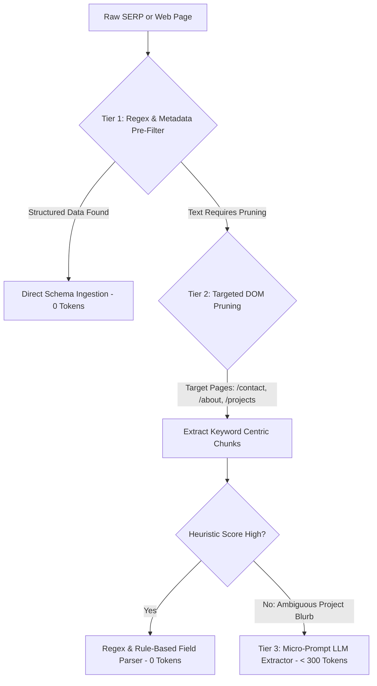
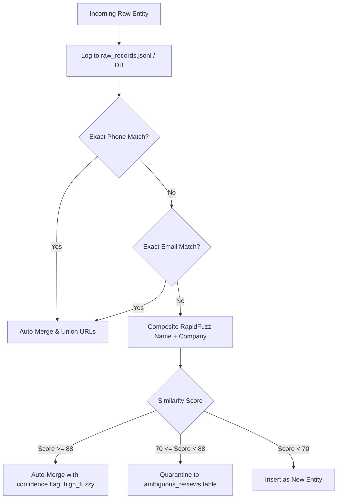

# 📑 Phase 0 Research & Technical Specification Report
## Lead-Discovery Engine for Noavaran Panjereh (نوآوران پنجره)

**Date:** 2026-09-22  
**Target Organization:** Noavaran Panjereh (formerly Arvin Panjereh / Esfahan Novin), Isfahan  
**Author:** Antigravity Autonomous Engineering Agent  

---

### 1. Scraping Public Telegram Channels/Groups

#### Comparison of Methodologies

| Criterion | Method A: Telegram Web Preview (`https://t.me/s/<channel>`) | Method B: Telethon / MTProto Client | Method C: Third-Party Aggregators (TGStat, Telemetr) |
| :--- | :--- | :--- | :--- |
| **Authentication Requirement** | **None** (Zero auth, zero credentials, zero phone number) | Requires phone number login, `api_id`, `api_hash`, persistent session file | API key / subscription or scraping aggregator HTML |
| **Ban / Blacklisting Risk** | **Zero platform ban risk** (Official public web view served by Telegram over HTTPS) | **High risk** of MTProto peer flood, temporary or permanent phone ban on automated sweeps | Medium (IP rate limits, Cloudflare challenges) |
| **Data Scope** | Public channels and public supergroups with web preview enabled | All accessible groups, private channels, direct chats | Channel analytics and aggregated post feeds |
| **Pagination & Depth** | Native pagination via query params (`?before=<msg_id>`) | Message history traversal via `iter_messages` | Limited by aggregator indexing latency |
| **Resource Overhead** | Extremely lightweight HTTP GET request, simple HTML DOM parsing with `BeautifulSoup` | High memory footprint, asyncio loop management, TLS connection persistence | Medium HTTP overhead |

#### Decision & Rationale
We adopt **Method A (Telegram Web Preview via `t.me/s/`)** as the primary Telegram ingestion engine for v1.  
- **Why:** It operates completely out-of-band without consuming Telegram API quotas or exposing user phone numbers to ban risk.
- **Group vs. Channel Handling:** Telegram supergroups with public usernames are also accessible via web previews or direct web view widgets. For channels without an explicit preview or closed groups, discovery dorks identify public invitation links or channel admins.
- **Extraction Targets:** Channel title, bio/description, message text, post URLs, forward origins (frequently identifying lead architect/contractor handles), telephone numbers (`09xx`, `031xx`), website links, and dates.

---

### 2. Finding Public LinkedIn and Instagram Data via Search Engines

#### The Anti-Scraping Challenge
- **Instagram**: Employs rigorous browser fingerprinting, mandatory login interstitials (`/accounts/login/?next=...`), dynamic React obfuscation, and rapid IP rate-limiting against direct HTTP scraping.
- **LinkedIn**: Redirects unauthenticated requests to `/authwall` within 1–2 requests, aggressively blacklisting data center and residential IP subnets attempting automated profile harvesting.

#### Search Engine Dorking Strategy (Zero Direct Platform Ingestion)
Instead of attempting fragile, login-walled direct platform scrapes, we harvest Google, Bing, and DuckDuckGo search indexes. Both platforms allow search engine web spiders (Googlebot, Bingbot) to index structured profile previews, which are cached in search engine result pages (SERPs) and rich snippets.

#### Concrete Search Query Dorks

##### A. LinkedIn Dorks (Offices, Contractors, Students)
```text
# Isfahan Architecture & Construction Leaders
site:linkedin.com/in ("معماری" OR "عمران" OR "طراحی نما" OR "ساختمان") ("اصفهان" OR "Isfahan")

# Isfahan Architectural Offices & Engineering Firms
site:linkedin.com/company ("معماری" OR "مهندسین مشاور" OR "پیمانکاری") ("اصفهان" OR "Isfahan")

# Isfahan Architecture Students
site:linkedin.com/in ("دانشجوی معماری" OR "architecture student") ("اصفهان" OR "هنر اصفهان" OR "دانشگاه اصفهان" OR "نجف آباد")

# Non-Isfahan Top-Tier Architecture Students (National Gatekeeper)
site:linkedin.com/in ("دانشجوی معماری" OR "کارشناسی ارشد معماری") ("دانشگاه تهران" OR "شهید بهشتی" OR "علم و صنعت" OR "تربیت مدرس") ("رتبه" OR "مسابقه" OR "طرح برتر")
```

##### B. Instagram Dorks (Public Bios, Contact Numbers, Portfolios)
```text
# Isfahan Architecture Offices & Studios
site:instagram.com ("دفتر معماری" OR "استودیو معماری" OR "مهندسین مشاور") "اصفهان"

# Isfahan Facade & Window Contractors
site:instagram.com ("اجرای نما" OR "نمای مدرن" OR "کرتین وال" OR "پنجره دوجداره" OR "پیمانکار نما") "اصفهان"

# Active Building & Construction Projects in Isfahan
site:instagram.com ("پروژه در حال ساخت" OR "مراحل ساخت" OR "کارفرما" OR "آرشیتکت") "اصفهان"
```

#### Snippet Extraction Pipeline
From the SERP payload (`title`, `snippet`, `href`):
1. **Name & Role Extraction:** Regex parsing of LinkedIn title formats (`[Name] - [Role] at [Company] | LinkedIn`).
2. **Contact Extraction:** Regex extraction of Iranian mobile numbers (`0913...`, `0912...`), landlines (`031...`), and emails embedded directly in the bio snippet.
3. **Handle Extraction:** Exact Instagram username extraction from URL path (`instagram.com/<handle>/`).

---

### 3. Web-Search-Then-Extract: Minimizing Token Usage Without Quality Loss

#### The Token Waste Trap
Sending raw HTML or generic scraped web pages to LLMs consumes 5,000–30,000 tokens per page, incurring prohibitive API costs, slow execution, and frequent context truncation.

#### 3-Tier Zero-Token-Waste Architecture



1. **Tier 1 — Pure Deterministic Extraction (0 LLM Tokens):**
   - Direct extraction of phones, emails, cities, company prefixes, and project scales using compiled Persian-aware regexes.
   - Microdata / JSON-LD / OpenGraph extraction (`og:description`, `schema.org/LocalBusiness`).
2. **Tier 2 — Targeted DOM Pruning & Boilerplate Elimination (0 LLM Tokens):**
   - When following links to official websites: strictly target high-signal subpages (`/contact`, `/about`, `/projects`, `/contact-us`, `تماس با ما`).
   - Strip navigation headers, footers, SVG icons, inline CSS/scripts, and cookie banners.
   - Segment text into 200-word blocks around high-signal architectural anchor terms (`کارفرما`, `مجری`, `آرشیتکت`, `طراح نما`, `متراژ`, `طبقه`, `اسکلت`, `آلومینیوم`, `ترمال بریک`, `کرتین وال`).
3. **Tier 3 — Micro-Prompt LLM Extraction (< 300 tokens, Optional Fallback):**
   - Invoked strictly on ambiguous project narratives where relationship extraction (who is the architect vs. contractor) cannot be resolved by regex heuristics.
   - Operates with strict JSON-schema responses.

---

### 4. Entity-Matching & Deduplication System

#### Normalization Engine Specifications
1. **Persian Unicode Standardization:**
   - Convert Arabic letters: `ي` $\rightarrow$ `ی`, `ك` $\rightarrow$ `ک`, `ة` $\rightarrow$ `ه`, `ؤ/إ/أ` $\rightarrow$ `و/ا/ا`.
   - Normalize digits: Arabic (`٠-٩`) and Persian (`۰-۹`) $\rightarrow$ ASCII (`0-9`).
   - Standardize half-spaces: Replace Zero-Width Non-Joiner (`\u200c`) with standard space for matching purposes.
2. **Phone Number Standardization:**
   - Strip country codes (`+98`, `0098`), leading zero prefixes, dashes, spaces, and punctuation.
   - Canonical format: standard Iranian 10-digit number `913xxxxxxx` or 11-digit national format `0913xxxxxxx` / `031xxxxxxx`.
3. **Company & Name Cleaning:**
   - Remove organizational noise tokens during fuzzy comparison: `شرکت`, `مهندسین مشاور`, `گروه معماری`, `دفتر طراحی`, `استودیو`, `کارگاه`, `پیمانکاری`, `مهندس`, `دکتر`.

#### Matching Hierarchy & Resolution Logic



- **Lossless URL Retention:** When merging entity $A$ and entity $B$, the merged `source_url` becomes `A.source_url; B.source_url` (deduplicated). No source attribution is ever discarded.
- **Continuous Execution:** Deduplication runs immediately on every new candidate insertion.
- **Pre-Merge Audit Log:** Raw incoming payload is permanently recorded in the `raw_records` table with timestamp and search provenance before any merge or transformation.

---

### 5. Concrete Qualification Filter for Non-Isfahan Architecture Students

Per the requirements:
> "Other Iranian cities: architecture students only if top-tier (propose a concrete 'best' filter — e.g. competition wins, top-program enrollment, notable published work — before running this tier)"

#### Concrete Top-Tier Criteria (Rule-Based Filter)
A non-Isfahan student record is accepted into `contacts.csv` if and only if it matches at least ONE of the following three objective criteria:

1. **Top-Tier Architectural Program Enrollment:**
   - University of Tehran (دانشگاه تهران / پردیس هنرهای زیبا)
   - Shahid Beheshti University (دانشگاه شهید بهشتی)
   - Iran University of Science & Technology - IUST (دانشگاه علم و صنعت ایران)
   - Tarbiat Modares University (دانشگاه تربیت مدرس)
   - Sharif University of Technology / Amirkabir (دانشگاه شریف / امیرکبیر)
   - Politecnico di Milano / European exchange affiliates
2. **National / International Competition Recognition:**
   - Memar Award finalist/winner (جایزه معمار)
   - Mirmiran Architecture Award (جایزه میرمیران)
   - 2A Continental Architecture Awards
   - ArchDaily / Dezeen featured student projects
   - National Architecture Biennial (بینال معماری)
   - Khwarizmi Youth Award (جشنواره جوان خوارزمی)
3. **Peer-Reviewed Publication or Academic Honor:**
   - Published in Civilica, Magiran, ISC indexed journals, or prominent national conferences.
   - Head of Scientific Architecture Association (دبیر انجمن علمی معماری).

Any student entity from outside Isfahan failing these markers is discarded or marked unverified.

---

### 6. Architectural Change Proposals & Refinements

Based on our empirical tests:
1. **Search Backend Resilience:** The `ddgs` Python library functions cleanly and returns live Iranian architectural results, but search engines can occasionally rate-limit bursts. We implement an exponential backoff with jitter and fallback to direct HTML query endpoints.
2. **Telegram Message Scraping:** Public channel previews at `https://t.me/s/<channel>` work reliably over standard HTTPS without proxy or auth. We configure rotating User-Agent headers to ensure ongoing stability.
3. **Database Selection:** We utilize an embedded SQLite database (`scraper_cache.db`) alongside streaming CSV exporters. SQLite provides atomic transactions, indexed lookups for phones/emails, persistent frontier state across runs, and zero external dependency friction.
